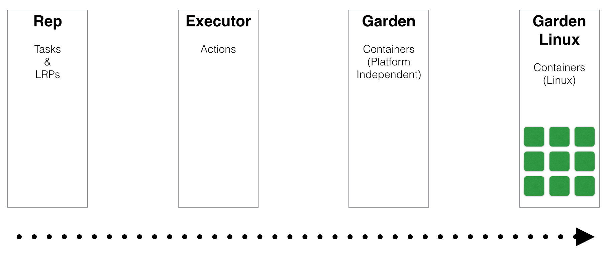
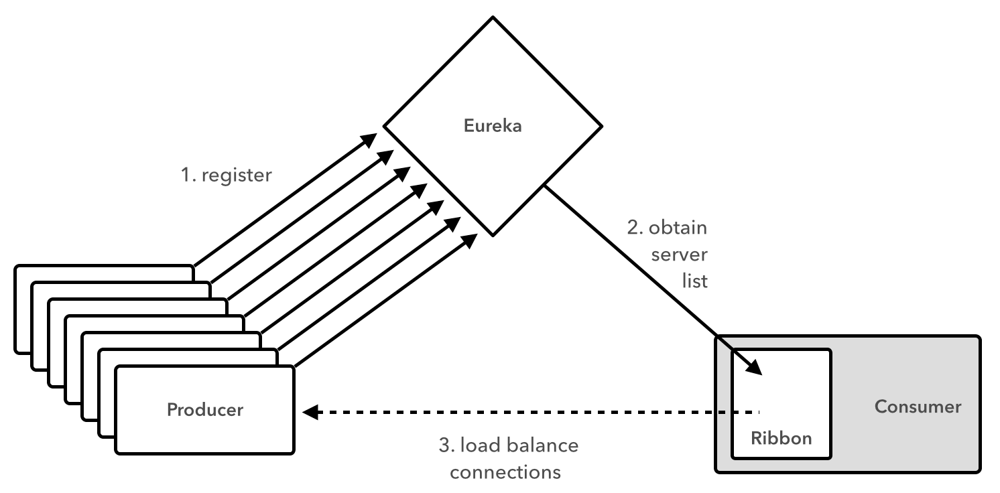

slidenumbers: true

# [fit] Cloud Foundry Diego
# [fit] _Modular and Extensible Substructure for Microservices_


---


# Me

_Matt Stine_ [@mstine](http://twitter.com/mstine)
_Principal Software Engineer_
_Pivotal_
[mstine@pivotal.io](mailto:mstine@pivotal.io)

---


# I wrote a little cloud book...

_FREE - Compliments of Pivotal_

[http://bit.ly/cloud-native-book](http://bit.ly/cloud-native-book)

---

# [fit] _Microservices?_


---

> Loosely coupled service oriented architecture with bounded contexts...
-- Adrian Cockcroft

---

#You must be this tall to use Microservices


* _RAPID PROVISIONING_
* _BASIC MONITORING_
* _RAPID APPLICATION DEPLOYMENT_
* _DEVOPS CULTURE_

[http://martinfowler.com/bliki/MicroservicePrerequisites.html](http://martinfowler.com/bliki/MicroservicePrerequisites.html)

---

# A Symbiotic Relationship


---

# Platform Features

* _Environment Provisioning_
* _On-Demand Scaling_
* _Failover/Resilience_
* _Routing/Load Balancing_
* _Data Service Operations (BOSH)_
* _Monitoring_

---

> But we need **MOAR** features...

---

# [fit] HARD
# [fit] _to add new features_
# [fit] HARD
# [fit] _to maintain existing features_

---

# Why is it HARD?


From _[https://www.youtube.com/watch?v=1OkmVTFhfLY](https://www.youtube.com/watch?v=1OkmVTFhfLY)_

---

# [fit] _Enter the_
# [fit] REWRITE

---

# What?


From _[https://www.youtube.com/watch?v=1OkmVTFhfLY](https://www.youtube.com/watch?v=1OkmVTFhfLY)_

---

# The result:


---

# _THIS_ is Diego


---

# Meet the _Receptor_


---

# [fit] TASKS
# [fit] _One-off Work_
# [fit] LRPS
# [fit] _Long-running Processes_

---

# DESIRED TASK

```json
{
    ...

    "rootfs": "docker:///docker-org/docker-image",
    "env": [
        {"name": "ENV_NAME_A", "value": "ENV_VALUE_A"},
        {"name": "ENV_NAME_B", "value": "ENV_VALUE_B"}
    ],

    "cpu_weight": 57,
    "disk_mb": 1024,
    "memory_mb": 128,
    "privileged": true,

    "action":  ACTION(s) TO RUN,

    ...
}
```

---

# ACTIONS

- RunAction: _run proc in container_
- DownloadAction: _fetches and extract archive_
- UploadAction: _POST file from container to URL_
- ParallelAction: _run multiple actions in parallel_
- SerialAction: _runs multiple actions in order_

---

# MOAR ACTIONS

- EmitProgressAction: _wraps action and logs progress_
- TimeoutAction: _wrap action and fail if timed out_
- TryAction: _wrap action and ignore errors_

---

# DESIRED LRP

```json
{
    ...

    "instances": 17,

    "rootfs": "VALID-ROOTFS",

    "env": [
        {"name": "ENV_NAME_A", "value": "ENV_VALUE_A"},
        {"name": "ENV_NAME_B", "value": "ENV_VALUE_B"}
    ],

    "cpu_weight": 57,
    "disk_mb": 1024,
    "memory_mb": 128,
    "privileged": true,

    "setup": ACTION,
    "action":  ACTION,
    "monitor": ACTION,
    "start_timeout": N seconds,

    "ports": [8080, 5050],

    ...
}
```

---

# Meet the _BBS_


---

# Let's have an _Auction_


---

# Let's have an _Auction_


---

# Let's have an _Auction_


---

# Inside the _Cell_


---

# Inside the _Cell_


---

# Inside the _Cell_


---

# Inside the _Cell_


---

# Specificity Gradient



^ Windows support == garden-windows

---

# _Rep_ resenting the Actual Work


---

# What is the _Truth_?


---

# What is the _Truth_?


---

# What is the _Truth_?


---

# CONVERGENCE


---

# Play with Diego?


---


# [fit] _Deploying Cloud Foundry is HARD_

---


https://lattice.cf

---

# _THIS_ IS LATTICE


---

# LATTICE _+_ DIEGO

- _Adds CF GoRouter (dynamic HTTP routing)_
- _Adds Doppler (log/metrics aggregation)_
- LOCAL: _vagrant up_
- CLOUD: _terraform apply_ (AWS, Google, DigitalOcean)

---

# [fit] DEMO

---

# [fit] _WHAT_
# [fit] ELSE_?_

---

# [fit] _Microservices_


---

# [fit] No Microservice
# [fit] is an _Island_


---

# Challenges of Distributed Systems

* _Configuration Management_
* _Service Registration & Discovery_
* _Routing & Load Balancing_
* _Fault Tolerance (Circuit Breakers!)_
* _Monitoring_
* _Concurrent API Aggregation & Transformation_

---


---


# [fit] Spring Cloud
# [fit] _Distributed System Patterns FTW!_

---

# Spring Cloud Lattice

- _[https://github.com/spring-cloud/spring-cloud-lattice](https://github.com/spring-cloud/spring-cloud-lattice)_
- _[https://spring.io/guides/gs/spring-cloud-and-lattice](https://spring.io/guides/gs/spring-cloud-and-lattice)_

---

# Eureka _+_ Ribbon



---

# Lattice _+_ Ribbon


---

# [fit] DEMO

---

# [fit] _Data_
# [fit] Microservices_?_


---

# Spring XD


_[http://projects.spring.io/spring-xd](http://projects.spring.io/spring-xd)_

---

# Spring XD Distributed Runtime


---

#Spring XD _SPI_ Model


---

# Spring XD _+_ Lattice


---

# [fit] DEMO

---

# _LEARN_ MORE!

- Lattice: _[http://lattice.cf](http://lattice.cf)_
- Diego Design Notes: _[https://github.com/cloudfoundry-incubator/diego-design-notes](https://github.com/cloudfoundry-incubator/diego-design-notes)_

---

# [fit] _THANK_
# [fit] YOU_!_
